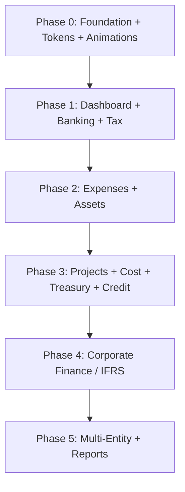

# Enterprise Finance Frontend -- QuickBooks/Zoho Benchmark Plan

> **Skills powering this plan:** `react-patterns` (RSC/React 19), `shadcn-ui` (component library), `ui-design-system` (tokens/WCAG), `tanstack-query-best-practices` (data fetching), `framer-motion-animator` (animations), `tailwind-css-patterns` (responsive/mobile-first), `tailwindcss-advanced-layouts` (grid/flexbox), `tailwindcss-animations` (CSS animations), `accessibility` (WCAG 2.2), `form-builder` (RHF+Zod), `next-best-practices` (file conventions/RSC boundaries), `nextjs-app-router-patterns` (streaming/parallel routes), `frontend-builder` (component architecture)

---

## 0. Quality Bar (Non-Negotiable)

### Product Qualities (what users experience)

- **Fast:** List pages feel instant -- server pagination + RSC streaming + optimistic UX via `useOptimistic` (`react-patterns`)
- **Guided:** Every workflow has "next best action" and clear status progression (Draft > Posted/Filed/etc)
- **Auditable:** Every critical screen has an Audit tab ("who did what when") + export evidence
- **Safe:** Permissions + approvals are visible, predictable, and impossible to bypass via UI
- **Boring-consistent:** Same patterns for list/detail/new, filters, bulk actions, side panels everywhere
- **Accessible:** WCAG 2.2 AA minimum -- semantic HTML, keyboard navigation, ARIA landmarks, 4.5:1 contrast ratios, 44x44px touch targets (`accessibility`)
- **Animated:** Purposeful micro-interactions -- page transitions, list stagger, card hover, toast slide (`framer-motion-animator`, `tailwindcss-animations`)

### Engineering Qualities (what code enforces)

- **One pattern everywhere:** `features/finance/{module}/(actions|queries|forms|blocks)` is the only valid structure (`frontend-builder`)
- **RSC-first:** Server components for lists/details; client only for forms, interactive tables, workspaces. Follow RSC boundary rules -- no async client components, only serializable props across the boundary (`react-patterns`, `next-best-practices`)
- **Typed contracts:** Zod at boundaries, strict TS DTOs, no `any`, no loose JSON parsing (`form-builder`)
- **URL = state:** Filters, sorts, pagination, active tab all live in URL via `nuqs` -- shareable, bookmarkable
- **Token-driven styling:** All colors, spacing, radii, shadows via CSS custom properties from `globals.css`. No hardcoded hex/px values in components (`ui-design-system`)
- **Mobile-first responsive:** Base styles for mobile, breakpoint prefixes for larger screens. Use `grid-cols-[repeat(auto-fit,minmax(250px,1fr))]` for card grids (`tailwind-css-patterns`, `tailwindcss-advanced-layouts`)
- **Query key factories:** All server state queries use hierarchical key factories with `staleTime` tuned per data volatility (`tanstack-query-best-practices`)

### Definition of Done (per module checklist)

Every module ships with ALL of:

- List page with server pagination, filters, search, bulk selection, export
- Detail page with tabs: Overview, Lines/Schedule, Attachments, Audit
- New/Edit page with RHF+Zod, `useTransition` submit-lock, idempotency, server errors via `useActionState` (`react-patterns`)
- `loading.tsx` for every route segment (skeleton with `animate-pulse`) (`tailwindcss-animations`)
- Empty state with CTA and illustration
- Status badges with icon + color (using semantic design tokens)
- Actions bar with status-aware buttons
- `revalidatePath` after every mutation (`next-best-practices`)
- Entrance animations: list items stagger in, cards fade-up (`framer-motion-animator`)
- Keyboard navigable: all interactive elements reachable via Tab, forms submit on Enter (`accessibility`)
- Focus indicators: visible outline on all focusable elements (`accessibility`)
- Responsive: functional at `sm` (480px), `md` (640px), `lg` (768px), `xl` (1024px) (`tailwind-css-patterns`)
- ARIA landmarks: `<main>`, `<nav>`, `<section aria-label>` for screen reader navigation (`accessibility`)

---

## 1. Current State Audit

### What exists (11 modules -- all functional, not stubs)

| Module        | List | Detail    | New    | Filters            | Pagination |
| ------------- | ---- | --------- | ------ | ------------------ | ---------- |
| Journals      | yes  | yes       | yes    | status tabs (URL)  | server     |
| Accounts      | yes  | yes       | yes    | type filter        | server     |
| Payables      | yes  | yes       | yes    | status tabs        | server     |
| Receivables   | yes  | yes       | yes    | status tabs        | server     |
| Trial Balance | yes  | --        | --     | ledger/year/period | --         |
| Ledgers       | yes  | yes       | yes    | --                 | server     |
| Periods       | yes  | --        | --     | year/status        | server     |
| Intercompany  | yes  | yes       | yes    | status tabs        | server     |
| Recurring     | yes  | yes       | yes    | active/inactive    | server     |
| FX Rates      | yes  | --        | inline | --                 | server     |
| Reports       | hub  | 4 reports | --     | ledger/period      | --         |

### What's missing (16 modules + 3 cross-cutting)

Tax, Fixed Assets, Bank Reconciliation, Credit, Expense Claims, Project Accounting, Leases (IFRS 16), Provisions (IAS 37), Treasury, Cost Accounting, Consolidation, Financial Instruments (IFRS 9), Hedge Accounting, Intangibles (IAS 38), Deferred Tax (IAS 12), Transfer Pricing, Dashboard, Approval Inbox, Document Management UI

### Measured code quality gaps in existing modules

**DataTable** (`apps/web/src/components/erp/data-table.tsx` -- 152 lines):

- Client-side only: no server pagination props, no URL filter sync, no column toggles, no bulk selection, no loading state, no export slot

**Forms** (e.g. `apps/web/src/features/finance/journals/forms/journal-draft-form.tsx`):

- Idempotency key generated but not passed to create actions (only post)
- No `revalidatePath`/`revalidateTag` after mutations -- relies on `router.refresh()`
- No draft auto-save for long forms
- Double-submit only prevented by `disabled={submitting}` (no `useTransition` guard on create) -- **should use `useTransition` + `useFormStatus` per `react-patterns`**

**Server actions** (e.g. `apps/web/src/features/finance/journals/actions/journal.actions.ts`):

- No `revalidatePath` calls -- all rely on client `router.refresh()` -- **violates `next-best-practices` revalidation rules**
- No optimistic updates -- **should use `useOptimistic` per `react-patterns`**
- No retry logic

**Error boundaries** (`apps/web/src/components/erp/error-boundary.tsx`):

- Exists but not integrated into component tree anywhere
- No error reporting to Sentry (Sentry config exists: `apps/web/sentry.edge.config.ts`)

**Command palette** (`apps/web/src/components/erp/command-palette.tsx`):

- Navigation only -- no content search (transactions, vendors, documents)

**Accessibility gaps** (per `accessibility` skill audit):

- No ARIA landmarks on shell layout (`<main>`, `<nav>`, `<aside>` not consistently applied)
- No `aria-label` on data tables or form sections
- Focus indicators rely on browser defaults (inconsistent cross-browser)
- No skip-to-content link
- No `aria-live` regions for toast notifications

**Design token gaps** (per `ui-design-system` skill audit):

- Chart color tokens exist but no semantic finance tokens (e.g., `--status-draft`, `--status-posted`, `--status-voided`)
- No fluid typography scale for responsive text sizing
- No motion tokens (`--duration-fast`, `--duration-normal`, `--easing-ease-out`)

---

## 2. Phase 0 -- Foundation Hardening (before adding 16 modules)

This phase fixes structural gaps so every new module inherits quality automatically.

### 0a. DataTable v2 (`components/erp/data-table.tsx`)

> **Skills applied:** `shadcn-ui` (table primitives), `tailwindcss-advanced-layouts` (responsive grid), `accessibility` (ARIA table semantics), `tailwindcss-animations` (skeleton pulse)

Upgrade the existing 152-line client-only DataTable into an enterprise-grade component:

- **Server pagination:** Accept `page`, `totalPages`, `onPageChange` (URL-based `<Link>` elements, not JS handlers)
- **URL-synced filters:** Filter chips rendered from `searchParams`, clear/modify via links
- **Column toggles:** Show/hide via `DropdownMenu` (shadcn), persist to localStorage
- **Bulk selection:** Checkbox column (`Checkbox` from shadcn) + selection state + actions slot (`bulkActions?: ReactNode`)
- **Loading state:** Accept `loading?: boolean` prop to show skeleton rows using `animate-pulse` pattern
- **Export slot:** Render `ExportMenu` in toolbar when `exportPayload` prop is provided
- **Empty state integration:** Use `EmptyState` when `data.length === 0`
- **Accessibility:** `role="grid"`, `aria-rowcount`, `aria-colcount`, sortable column headers with `aria-sort`, checkbox column with `aria-label="Select row"` (`accessibility`)
- **Responsive:** Horizontal scroll on mobile with `overflow-x-auto`, pinned first column on `<md` breakpoints (`tailwindcss-advanced-layouts`)

Key file: `apps/web/src/components/erp/data-table.tsx`

### 0b. URL State Infrastructure

> **Skills applied:** `react-patterns` (custom hooks), `nextjs-app-router-patterns` (searchParams handling)

Create a `useFilterParams` hook built on `nuqs` (already installed):

```typescript
const { filters, setFilter, clearFilters, sortBy, page } = useFilterParams({
  status: parseAsString,
  period: parseAsString,
  page: parseAsInteger.withDefault(1),
  sort: parseAsString,
});
```

- Sync tab state to URL (BusinessDocument tabs, filter tabs)
- Every filter change produces a shareable URL
- Saved views: store named filter presets per module (localStorage first, DB later)
- **Note:** `searchParams` is async in Next.js 15+ -- ensure `useFilterParams` handles this correctly (`next-best-practices` async patterns)

Key files: `apps/web/src/hooks/use-filter-params.ts`, `apps/web/src/hooks/use-saved-views.ts`

### 0c. Navigation Restructure (`constants.ts`)

> **Skills applied:** `shadcn-ui` (collapsible/accordion), `tailwindcss-animations` (expand/collapse transition), `accessibility` (nav landmarks), `framer-motion-animator` (smooth height animation)

Replace flat 11-item Finance nav with 13 functional groups:

1. **Overview** -- Dashboard, Activity
2. **Core Ledger** -- Journals, Chart of Accounts, Ledgers, Periods, Trial Balance
3. **Customers & Receipts** -- Receivables, Dunning, Credit Management
4. **Vendors & Payments** -- Payables, Payment Runs, Expense Claims
5. **Banking** -- Bank Accounts, Statements, Reconciliation
6. **Tax & Compliance** -- Tax Codes/Rates, Returns, WHT, Deferred Tax
7. **Assets** -- Fixed Assets, Depreciation Runs, Intangibles
8. **Projects & Cost** -- Projects, Cost Centers, Allocations
9. **Treasury** -- Cash Forecast, Covenants, IC Loans
10. **Corporate Finance** -- Leases, Provisions, Instruments, Hedging
11. **Multi-Entity** -- Intercompany, Consolidation, Transfer Pricing
12. **Reports** -- Statements, Aging, Tax, Assets, Allocations, Consolidation
13. **Configuration** -- Recurring, FX Rates, Budgets, Approval Policies

Update `SidebarNav` to support nested collapsible sub-groups:

- Use `Collapsible` from shadcn with `AnimatePresence` + `motion.div` for smooth height transitions
- `<nav aria-label="Finance navigation">` with `role="tree"` / `role="treeitem"` for nested items (`accessibility`)
- Add badge counts on "Approvals" item (pending count from server, use `animate-ping` dot indicator from `tailwindcss-animations`)
- Keyboard: arrow keys navigate tree, Enter/Space expand/collapse (`accessibility`)

Add ALL new routes to `routes.finance` object.

### 0d. Approvals Inbox Scaffold

> **Skills applied:** `react-patterns` (server components + useOptimistic), `shadcn-ui` (dialog, badge), `framer-motion-animator` (list stagger animation), `accessibility` (aria-live for SLA updates)

Even before all modules use approvals, build the inbox:

- `/finance/approvals` -- list of pending approval requests (mine)
- SLA signals: due date, overdue indicator (red `Badge` with `animate-pulse`), amount, triggering policy
- "Why is this blocked?" policy preview (`Sheet` side panel from shadcn)
- Actions: Approve / Reject with reason dialog (`AlertDialog` from shadcn)
- **Optimistic updates:** Use `useOptimistic` to immediately move approved items out of list while server confirms (`react-patterns`)
- Delegation / substitute approver (stub -- backend `approvalStep` supports it)
- **Animation:** List items stagger entrance with `framer-motion-animator` variants; approved items animate out with exit animation
- **Accessibility:** `aria-live="polite"` region for SLA countdown updates, button labels "Approve invoice INV-001 for $5,000"

Key files: `app/(shell)/finance/approvals/page.tsx`, `features/finance/approvals/`

### 0e. Document Widget + Viewer

> **Skills applied:** `shadcn-ui` (sheet, tabs), `tailwindcss-advanced-layouts` (right-rail layout), `framer-motion-animator` (upload progress animation), `accessibility` (drag-and-drop alternative)

Reusable components consumed by every module:

- `<DocumentUpload entityType entityId />` -- upload widget with drag-and-drop, progress bar, naming rules. **Must include keyboard-accessible file picker as drag-and-drop alternative** (`accessibility`)
- `<DocumentViewer url mimeType />` -- right-rail PDF/image preview in `Sheet` (side="right") from shadcn
- `<AttachmentsTab entityType entityId />` -- standard tab for BusinessDocument
- Uses existing `@afenda/storage` R2 adapter and `document-repo.ts`
- **Upload animation:** Progress bar with spring physics, success checkmark with scale animation (`framer-motion-animator`)

Key files: `components/erp/document-upload.tsx`, `components/erp/document-viewer.tsx`, `components/erp/attachments-tab.tsx`

### 0f. Reports Hub Upgrade

> **Skills applied:** `shadcn-ui` (chart component), `tailwind-css-patterns` (responsive grid for report cards), `accessibility` (chart accessibility layer)

- **Drilldown contract:** Every report number is clickable: Statement > Account > Journal lines > Source document
- **Favorites:** Pin reports to personal favorites (localStorage)
- **Consistent picker:** Reusable `<ReportFilterBar>` with ledger/period/year/date-range (upgrade existing `report-filter-bar.tsx`)
- **Export on every report:** CSV + PDF (print) via existing `ExportMenu`
- Add Budget Variance and IC Aging to the reports hub page
- **Chart accessibility:** All charts use `accessibilityLayer` prop from shadcn chart component for keyboard navigation and screen reader support (`shadcn-ui`, `accessibility`)
- **Report grid:** Use `grid-cols-[repeat(auto-fit,minmax(280px,1fr))]` for responsive report card layout (`tailwindcss-advanced-layouts`)

### 0g. Form Pattern Hardening

> **Skills applied:** `form-builder` (RHF+Zod), `react-patterns` (useTransition, useActionState, useOptimistic), `next-best-practices` (revalidatePath), `accessibility` (form a11y)

Fix quality gaps across all existing + new forms:

- **Idempotency:** Pass `idempotencyKey` to ALL mutation actions (not just `post`)
- **Revalidation:** Add `revalidatePath('/finance/{module}')` to every server action (`next-best-practices`)
- **Submit lock:** Wrap all form submits in `useTransition` (not manual `submitting` state). Use `useFormStatus` for submit button state in child components (`react-patterns`)
- **Draft auto-save:** `useDraftSave(formId, watch)` hook for long forms (leases, instruments) -- debounced save to localStorage, restore on mount
- **Server error display:** Standardize `useActionState` pattern for showing server errors inline (`react-patterns`)
- **Optimistic mutations:** Apply `useOptimistic` for status changes (post journal, approve claim) to eliminate perceived latency (`react-patterns`)
- **Form accessibility:** Every `<FormField>` uses `<FormLabel>` with `htmlFor`, error messages linked via `aria-describedby`, required fields marked with `aria-required` (`form-builder`, `accessibility`)
- **Multi-step forms:** Wizard pattern for complex flows (depreciation run, allocation run) with step indicator and keyboard-navigable step list

Apply to existing: journals, accounts, payables, receivables, intercompany, recurring, ledgers

### 0h. Frontend Observability

> **Skills applied:** `next-best-practices` (error.tsx convention), `react-patterns` (error boundaries)

- Wrap shell layout in `ErrorBoundary` (existing component, currently unused)
- Wire error boundary to Sentry (`captureException`)
- Add `correlationId` to error screens ("Report this issue: ABC-123")
- Toast on action failure with error summary + retry link
- **Error.tsx convention:** Add `error.tsx` to every route group that doesn't have one (`next-best-practices`)
- **Recovery:** Use `useQueryErrorResetBoundary` from TanStack Query for data-fetch errors (`tanstack-query-best-practices`)

### 0i. Design Token Hardening (NEW)

> **Skills applied:** `ui-design-system` (token generation, WCAG contrast), `tailwind-css-patterns` (CSS variables integration)

Audit and extend `globals.css` design tokens:

- **Finance semantic tokens:** Add `--status-draft`, `--status-pending`, `--status-posted`, `--status-voided`, `--status-overdue` with light/dark variants
- **Chart palette:** Ensure `--chart-1` through `--chart-8` tokens cover all dashboard chart needs
- **Motion tokens:** Add `--duration-fast: 150ms`, `--duration-normal: 300ms`, `--duration-slow: 500ms`, `--easing-ease-out: cubic-bezier(0.16, 1, 0.3, 1)`
- **Fluid typography:** Add `--fluid-h1` through `--fluid-body` using `clamp()` for responsive text
- **WCAG AA validation:** Verify all foreground/background token pairs meet 4.5:1 contrast for normal text, 3:1 for large text (`ui-design-system`, `accessibility`)
- **Spacing audit:** Ensure 8pt grid consistency -- all padding/margin uses `space-{n}` tokens from Tailwind scale

Key file: `apps/web/src/app/globals.css`

### 0j. Animation System (NEW)

> **Skills applied:** `framer-motion-animator` (motion presets, AnimatePresence), `tailwindcss-animations` (CSS-only animations)

Create shared animation library consumed by all modules:

- `**motion-presets.ts`: Reusable Framer Motion variants
  - `fadeIn` -- standard page/card entrance (opacity 0→1, y 20→0, 300ms)
  - `slideIn` -- sheet/panel entrance (x 100%→0, spring physics)
  - `staggerContainer` / `staggerItem` -- list item stagger (50ms delay per item)
  - `scaleOnHover` -- interactive card hover (scale 1.02, spring stiffness 400)
  - `exitFade` -- standard exit for AnimatePresence
- **CSS-only animations** (for non-JS contexts like loading.tsx):
  - `animate-pulse` for skeleton loaders (already built-in Tailwind)
  - `animate-ping` for notification badges
  - Custom `animate-slide-up` keyframe for toast entrances
- **Performance rule:** Only animate `transform` and `opacity` (GPU-accelerated). Never animate `width`, `height`, `top`, `left`.
- **Reduced motion:** Wrap all animations in `prefers-reduced-motion` check; Framer Motion's `useReducedMotion` hook (`accessibility`)

Key file: `apps/web/src/lib/motion-presets.ts`

---

## 3. Phase 1 -- Dashboard + Banking + Tax (High-ROI)

### 1a. Finance Dashboard (`/finance/dashboard`)

> **Skills applied:** `shadcn-ui` (chart, card, badge), `tailwindcss-advanced-layouts` (dashboard grid), `framer-motion-animator` (KPI counter animation), `tailwind-css-patterns` (responsive breakpoints), `tanstack-query-best-practices` (dashboard queries with staleTime)

**Silent killers to avoid:**

- KPIs without drilldown (pretty but useless)
- No "Needs Attention" queue
- Charts without keyboard accessibility

**Implementation:**

- KPI cards: Cash Balance, Open AR total, Open AP total, Overdue count, Current Period health -- each card links to filtered list
  - **Animated counters:** Use `framer-motion-animator` `useMotionValue` + `useTransform` for counting-up animation on mount
  - **Card hover:** `scaleOnHover` preset with shadow elevation change
- Charts (via shadcn `chart` component wrapping `recharts`): Revenue vs Expenses (bar), Cash Flow Trend (line), AR Aging Distribution (donut)
  - Use `ChartContainer` + `ChartConfig` with `--chart-{n}` tokens from `globals.css`
  - **Add `accessibilityLayer`** to all `<BarChart>`, `<LineChart>`, `<PieChart>` for keyboard navigation (`shadcn-ui`)
  - Use `ChartTooltipContent` and `ChartLegendContent` for consistent tooltip/legend styling
- "Needs Attention" queue: Unreconciled bank lines, Overdue invoices, Pending approvals, Approaching period close
  - **List stagger:** Items animate in with `staggerContainer` / `staggerItem` variants
- Quick actions: New Journal, New Invoice, New Expense Claim
- Recent activity feed (from journal audit trail)
- **Dashboard layout:** Use CSS Grid `grid-cols-1 md:grid-cols-2 xl:grid-cols-4` for KPI row, `grid-cols-1 lg:grid-cols-[2fr_1fr]` for charts + attention queue (`tailwindcss-advanced-layouts`)
- **Query strategy:** Use `queryOptions` factory with `staleTime: 30_000` for dashboard KPIs (refreshes every 30s), `staleTime: 60_000` for charts (`tanstack-query-best-practices`)
- Leverage existing `dashboard.queries.ts` (27 lines, returns cash balance, AR/AP totals, current period, recent activity)

### 1b. Banking (`/finance/banking`)

> **Skills applied:** `shadcn-ui` (resizable panels), `tailwindcss-advanced-layouts` (split-screen grid), `react-patterns` (useOptimistic for match confirmation), `tanstack-query-best-practices` (prefetch on hover)

**Silent killers to avoid:**

- Manual-only matching (no suggestions)
- No split transactions / partial matches

**Implementation:**

- **Statements list:** Filter by account, date range, status (unreconciled/partial/reconciled)
- **Import:** CSV/OFX upload via document widget, parsing preview, confirm import
- **Reconciliation workspace:** Split-screen using `ResizablePanelGroup` from shadcn -- statement lines left, GL matches right
  - Layout: `grid-cols-[1fr] lg:grid-cols-[minmax(400px,1fr)_minmax(400px,1fr)]` for responsive split (`tailwindcss-advanced-layouts`)
- **Match suggestions:** Auto-match by amount/date/reference with confidence score
  - **Prefetch:** Prefetch match suggestions on row hover using `prefetchQuery` (`tanstack-query-best-practices` `pf-intent-prefetch`)
  - **Optimistic confirm:** `useOptimistic` to immediately show match as confirmed (`react-patterns`)
- **Exceptions queue:** Unmatched lines requiring manual attention
- **Confirm/reject** with audit trail
- **Keyboard shortcuts:** `m` to match, `u` to unmatch, arrow keys to navigate lines (`accessibility`)

### 1c. Tax & Compliance (`/finance/tax`)

> **Skills applied:** `shadcn-ui` (calendar/date-picker for effective dating), `form-builder` (multi-step tax return form), `accessibility` (tax rate table semantics)

**Silent killers to avoid:**

- Tax rates without effective dating
- No filing workflow status

**Implementation:**

- **Tax Codes** list + CRUD (hierarchical jurisdiction tree using `Accordion` from shadcn)
- **Tax Rates** with effective date ranges, rate history timeline
  - Date range picker using shadcn `Calendar` + `Popover`
- **Tax Return Periods** with status workflow (Open > Filed > Assessed > Adjusted)
  - Status badges using semantic tokens (`--status-draft`, `--status-posted`)
- **WHT Certificates** list + issue dialog
- **Tax Summary Report** (drilldown to source transactions)

---

## 4. Phase 2 -- Expenses + Assets (High-Frequency)

### 2a. Fixed Assets (`/finance/assets/fixed`)

> **Skills applied:** `shadcn-ui` (tabs, progress), `form-builder` (depreciation run wizard), `framer-motion-animator` (wizard step transitions)

**Silent killers to avoid:**

- Depreciation runs without preview/reversal
- Disposal without gain/loss preview

**Implementation:**

- Asset register with filters (class, location, status, acquisition date range)
- Asset detail tabs: Overview, Components, Depreciation Schedule, Movements, Attachments, Audit
- Depreciation Run wizard: select period > preview impact > execute > receipt
  - **Wizard animation:** Steps transition with `slideIn` / `exitFade` via `AnimatePresence` (`framer-motion-animator`)
  - **Form pattern:** Multi-step form with RHF context shared across steps (`form-builder`)
- Disposal workflow: dialog with computed gain/loss, GL impact preview
- **Budget bar:** Use `Progress` from shadcn for depreciation % complete

### 2b. Intangible Assets (`/finance/assets/intangibles`)

- Register list + detail with amortization schedule tab
- Same patterns as fixed assets (lighter)

### 2c. Expense Claims (`/finance/expenses`)

> **Skills applied:** `shadcn-ui` (file upload, tabs), `form-builder` (line items with dynamic fields), `react-patterns` (useOptimistic for submit), `accessibility` (receipt upload alt text)

**Silent killers to avoid:**

- No quick receipt upload UX
- No policy validation at entry time

**Implementation:**

- **My Claims / All Claims** toggle (personal vs approver view)
- **New Claim** form: line items with category, amount, receipt upload (document widget), multi-currency
  - **Dynamic line items:** `useFieldArray` from RHF for adding/removing expense lines (`form-builder`)
  - **Inline policy validation:** Show rule violations inline ("Exceeds $500 meal limit") as `FormMessage` with `variant="destructive"` styling
- **Policy engine UX:** Override-request option with justification field
- **Approval workflow:** Status progression, approver display, delegation
- **Expense Policies** management page (admin)

---

## 5. Phase 3 -- Projects, Cost, Treasury, Credit (Mid-Enterprise)

### 3a. Project Accounting (`/finance/projects`)

> **Skills applied:** `shadcn-ui` (progress bars, tabs), `tailwindcss-advanced-layouts` (budget grid), `tanstack-query-best-practices` (project detail parallel queries)

**Silent killers to avoid:**

- No WIP visibility, billing wizard feels fake
- Budget vs actual without drilldown

**Implementation:**

- Projects list with status, budget progress bars (`Progress` from shadcn, % utilized)
- Project detail tabs: Overview, Cost Lines, Billings, WIP Analysis, Attachments, Audit
  - **Parallel queries:** Load cost lines, billings, and WIP data in parallel using `useSuspenseQueries` (`tanstack-query-best-practices`)
- Billing wizard: select unbilled costs > preview invoice > generate
- Budget vs actual comparison with variance (bar chart using shadcn `chart`)

### 3b. Cost Accounting (`/finance/cost-accounting`)

> **Skills applied:** `shadcn-ui` (accordion for tree), `tailwindcss-advanced-layouts` (tree layout), `framer-motion-animator` (tree expand animation)

**Silent killers to avoid:**

- No allocation explainability ("why was I charged?")

**Implementation:**

- Cost center hierarchy (tree view with `Accordion`/`Collapsible` from shadcn, animated expand with `framer-motion-animator`)
- Cost drivers management (headcount, sqft, revenue)
- Allocation run wizard: select driver > preview > execute > results drilldown
- Results page: line-by-line "From cost center X to Y, amount Z, driver: headcount (45/200)"

### 3c. Treasury (`/finance/treasury`)

> **Skills applied:** `shadcn-ui` (chart, badge), `tailwind-css-patterns` (responsive layout)

**Silent killers to avoid:**

- Forecast without assumptions = unused
- Covenants without breach alerts

**Implementation:**

- Cash forecasts by horizon with scenario tagging (base/best/worst stub)
  - Line chart with multiple series using shadcn `chart` component
- Covenant monitoring: compliance indicators (green/amber/red `Badge` components), breach history
  - **Semantic colors:** Use `--status-` tokens for green/amber/red states
- IC Loans: list + detail with amortization schedule, interest accrual status

### 3d. Credit Management (`/finance/credit`)

> **Skills applied:** `shadcn-ui` (progress for utilization), `react-patterns` (useOptimistic for hold toggle)

**Silent killers to avoid:**

- Credit holds without customer context in AR workflow

**Implementation:**

- Credit limits per customer with utilization bars (`Progress` from shadcn, used/available)
- Review history + next review date
- Hold management: place/release with reason, visible in AR invoice detail
  - **Optimistic toggle:** `useOptimistic` for immediate hold/release feedback (`react-patterns`)
- Integration: AR invoice creation shows credit warning/block

---

## 6. Phase 4 -- Corporate Finance / IFRS (Enterprise Differentiation)

> **Skills applied across all Phase 4 modules:** `shadcn-ui` (tabs, sheet, table), `form-builder` (evidence forms), `framer-motion-animator` (tab transitions), `accessibility` (complex table semantics)

All corporate finance modules share a common pattern: register list + detail with **evidence tabs** (assumptions, rate sources, approval trail, generated journals).

### 4a. Lease Accounting -- IFRS 16 (`/finance/leases`)

- Contracts list (operating/finance classification)
- Detail: ROU asset, lease liability, amortization schedule, modification timeline
- Evidence: assumptions tab, generated GL journals tab
- **Draft auto-save:** Enable `useDraftSave` for lease contract forms (complex, long-lived) (`form-builder`)

### 4b. Provisions -- IAS 37 (`/finance/provisions`)

- Register with categories and utilization tracking
- Movements timeline (create, utilize, reverse, adjust) with audit
- **Timeline animation:** Movement entries stagger in chronologically (`framer-motion-animator`)

### 4c. Financial Instruments -- IFRS 9 (`/finance/instruments`)

- Register with classification (amortized cost, FVTPL, FVOCI)
- Fair value measurements with level hierarchy (1/2/3)
- Evidence: valuation methodology, data sources

### 4d. Hedge Accounting -- IFRS 9 (`/finance/hedging`)

- Relationships list (fair value / cash flow / net investment)
- Effectiveness tests with pass/fail indicators (green/red badges with semantic tokens)
- Documentation tab (IFRS 9 hedge documentation requirements)

### 4e. Deferred Tax -- IAS 12 (`/finance/deferred-tax`)

- Items list with temporary difference analysis
- DTA/DTL summary with net position
- Reconciliation to statutory rate

---

## 7. Phase 5 -- Multi-Entity + Expanded Reports

### 5a. Consolidation (`/finance/consolidation`)

> **Skills applied:** `tailwindcss-advanced-layouts` (entity tree grid), `framer-motion-animator` (tree expansion), `shadcn-ui` (accordion)

**Silent killers to avoid:**

- No ownership tree clarity
- No eliminations drilldown

**Implementation:**

- Group entity tree (visual hierarchy with ownership %) -- animated tree expand using `framer-motion-animator`
- Ownership records management
- Goodwill register
- Consolidation report with eliminations drilldown

### 5b. Transfer Pricing (`/finance/transfer-pricing`)

**Silent killers to avoid:**

- TP policies without benchmarking evidence

**Implementation:**

- Policy register (CUP, TNMM, etc.)
- Benchmarks with comparable data
- Evidence attachments via document widget

### 5c. Expanded Reports

> **Skills applied:** `shadcn-ui` (chart components), `tailwindcss-advanced-layouts` (responsive report grid), `accessibility` (chart keyboard nav)

Add to the existing reports hub:

- Equity Statement
- AP Aging, AR Aging (dedicated pages with bucket drilldown) -- bar chart with `accessibilityLayer`
- Tax Summary
- Asset Register Report (with depreciation summary)
- Cost Allocation Report
- Consolidation Report
- **All reports:** Use `grid-cols-[repeat(auto-fit,minmax(280px,1fr))]` for responsive card layout

---

## 8. Cross-Cutting Capabilities ("SaaS Polish" Layer)

These apply to ALL modules and must be part of the Definition of Done:

### Bulk Actions (every list page)

> **Skills applied:** `shadcn-ui` (checkbox, dropdown-menu, alert-dialog), `react-patterns` (useOptimistic for bulk operations)

- Checkbox selection in DataTable v2
- Toolbar: Delete, Void, Assign, Export selected
- Confirmation dialog with count + impact preview (`AlertDialog` from shadcn)
- **Optimistic removal:** Selected items fade out immediately on confirm (`framer-motion-animator` + `useOptimistic`)

### Consistent Empty States (every list page)

> **Skills applied:** `framer-motion-animator` (entrance animation for empty state illustration)

- Descriptive message + CTA ("Create your first journal entry")
- Already have `empty-state.tsx` -- ensure every list uses it
- **Animation:** Empty state illustration fades in with subtle scale (0.95→1.0)

### Print/Export (every detail + list page)

- CSV + JSON via existing `export-menu.tsx`
- Print-optimized layout via existing `@media print` rules in globals.css
- Future: Excel export (Phase 2+)

### Global Search Enhancement

> **Skills applied:** `shadcn-ui` (command palette), `tanstack-query-best-practices` (search with debounce)

- Upgrade `command-palette.tsx` from navigation-only to content search
- Search transactions by number/description, vendors/customers by name, documents by reference
- **Debounced search:** Use TanStack Query with `keepPreviousData: true` and debounced query key (`tanstack-query-best-practices`)
- Recent items section
- Phase 0 scope: navigation + recent items. Phase 2: full content search

### Audit Tab (every detail page)

> **Skills applied:** `shadcn-ui` (table, select for filters), `accessibility` (audit trail table semantics)

- Standard tab using existing `audit-panel.tsx`
- Add filtering (by action, by user, by date range)
- Add pagination for long audit trails
- **Table accessibility:** `aria-label="Audit trail"`, sortable columns, screen reader announcements for filter changes

### Skip-to-Content & Keyboard Navigation (NEW)

> **Skills applied:** `accessibility`

- Add `<a href="#main-content" class="sr-only focus:not-sr-only">Skip to content</a>` at top of shell layout
- Ensure consistent focus order across all pages
- Add keyboard shortcuts overlay (`?` to show, consistent with QuickBooks pattern)
- All modal dialogs trap focus and return focus on close (already handled by Radix via shadcn)

### Responsive Breakpoint Strategy (NEW)

> **Skills applied:** `tailwind-css-patterns` (mobile-first), `tailwindcss-advanced-layouts` (responsive patterns)

Standard breakpoint behavior across all modules:

| Breakpoint | Width   | Layout behavior                                          |
| ---------- | ------- | -------------------------------------------------------- |
| Base       | <480px  | Single column, hamburger nav, stacked cards              |
| `sm`       | 480px+  | 2-column card grids, visible search                      |
| `md`       | 640px+  | Sidebar visible (collapsible), 2-col form layouts        |
| `lg`       | 768px+  | Full sidebar, detail page tabs horizontal, split screens |
| `xl`       | 1024px+ | Dashboard 4-col KPIs, right-rail panels, wider tables    |
| `2xl`      | 1280px+ | Max-width container, comfortable reading width           |

---

## 9. Technical Dependencies

### New shadcn/ui components to install

- `calendar` + `date-picker` -- date range filters, effective dating
- `resizable` -- bank reconciliation split-screen
- `chart` -- dashboard charts (recharts wrapper with `ChartContainer`, `ChartConfig`, `ChartTooltipContent`)
- `checkbox` -- bulk selection in DataTable
- `progress` -- utilization bars, budget progress
- `accordion` -- hierarchical displays (cost centers, entity tree)
- `collapsible` -- sidebar nav groups

### New npm packages

- `recharts` -- charting (chart tokens already in globals.css)
- `framer-motion` -- animations and page transitions
- No other new packages needed (nuqs, react-hook-form, zod, lucide already installed)

### Shared utility files to create (Phase 0)

| File                         | Purpose                          | Skill source                    |
| ---------------------------- | -------------------------------- | ------------------------------- |
| `lib/motion-presets.ts`      | Framer Motion variant library    | `framer-motion-animator`        |
| `hooks/use-filter-params.ts` | URL-synced filter state          | `react-patterns`                |
| `hooks/use-saved-views.ts`   | Named filter presets             | `react-patterns`                |
| `hooks/use-draft-save.ts`    | Auto-save long forms             | `form-builder`                  |
| `lib/query-keys.ts`          | Hierarchical query key factories | `tanstack-query-best-practices` |
| `globals.css` additions      | Semantic + motion + fluid tokens | `ui-design-system`              |

### File count estimate

- Phase 0 (foundation): ~30-35 files (upgrades + new hooks + tokens + animation system + scaffold pages)
- Phase 1-5 (16 modules): ~250-280 files (avg 16 per module)
- Cross-cutting enhancements: ~20-25 files
- Total: ~300-340 new/modified files

---

## 10. Execution Order Rationale



- **Phase 0 first:** Every subsequent module inherits DataTable v2, URL state, document widget, form hardening, design tokens, animation presets, and accessibility foundations. Without this, we build 16 modules on a shaky foundation and then retrofit.
- **Design tokens + animation system in Phase 0 (NEW):** These are consumed by every component in every phase. Establishing them early prevents style inconsistency and retrofitting motion later.
- **Dashboard + Banking + Tax in Phase 1:** Dashboard drives daily usage/stickiness. Banking reconciliation is the #1 feature that retains accountants. Tax is compliance-mandatory.
- **Expenses + Assets in Phase 2:** Highest transaction frequency after core GL. CFO trust depends on asset register + depreciation.
- **Projects + Cost + Treasury + Credit in Phase 3:** Mid-enterprise differentiation. These separate "accounting software" from "ERP."
- **Corporate Finance in Phase 4:** IFRS compliance tier. Required by enterprise customers but lower daily frequency.
- **Consolidation + TP + Reports in Phase 5:** Multi-entity features. These require all earlier modules to exist for full data flow.

---

## 11. Skill Reference Matrix

Quick reference for which skill to consult during each type of work:

| Task                   | Primary Skill                   | Supporting Skills               |
| ---------------------- | ------------------------------- | ------------------------------- |
| Building any component | `react-patterns`                | `frontend-builder`, `shadcn-ui` |
| Styling & layout       | `tailwind-css-patterns`         | `tailwindcss-advanced-layouts`  |
| Form creation          | `form-builder`                  | `shadcn-ui`, `accessibility`    |
| Data fetching          | `tanstack-query-best-practices` | `react-patterns`                |
| Animations             | `framer-motion-animator`        | `tailwindcss-animations`        |
| Accessibility audit    | `accessibility`                 | `ui-design-system`              |
| Design tokens          | `ui-design-system`              | `tailwind-css-patterns`         |
| Route structure        | `nextjs-app-router-patterns`    | `next-best-practices`           |
| Server actions         | `next-best-practices`           | `react-patterns`                |
| Loading states         | `tailwindcss-animations`        | `shadcn-ui`                     |
