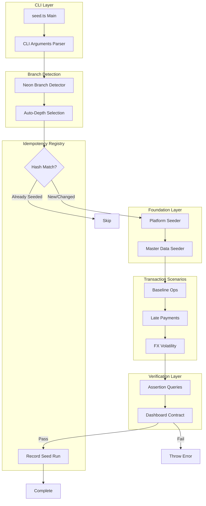
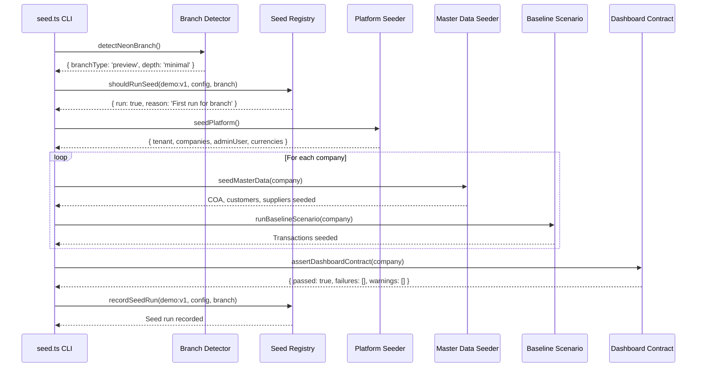

# Database Seeding Architecture

Production-grade database seeding system for NEXUSCANON-AFENDA with Neon Postgres integration.

## Overview

The seeding system provides deterministic, idempotent, and RLS-safe database initialization for development, testing, and demo environments. It automatically adapts to Neon branch types (main/dev/preview/test) and ensures all dashboard visualizations have sufficient data.

### Key Features

- **Deterministic**: Same seed number produces identical data across runs
- **Idempotent**: Safe to run multiple times (hash-based change detection)
- **RLS-Safe**: All multi-tenant operations properly isolated
- **Branch-Aware**: Auto-adjusts depth based on Neon branch type
- **Dashboard-Verified**: Guarantees all charts will populate
- **Performance-Optimized**: Batch inserts, direct connections, pooled guard

## System Architecture



## Component Responsibilities

### 1. CLI Layer (`packages/db/src/seed.ts`)

**Purpose**: Entry point with argument parsing and orchestration

**Key Functions**:
- Parse CLI flags (`--seed`, `--depth`, `--months`, `--scenarios`, `--reset`, `--verify`)
- Detect Neon branch type and auto-select depth
- Check idempotency before seeding
- Orchestrate platform → master → scenarios → verification flow
- Record seed run in registry

**Dependencies**:
- `node:util` - parseArgs for CLI
- `./utils/seed-client` - Direct connection client
- `./utils/neon-branch-detector` - Branch type detection
- `./utils/idempotency` - Hash-based change detection

### 2. Neon Branch Detector (`packages/db/src/utils/neon-branch-detector.ts`)

**Purpose**: Detect Neon branch from environment and auto-select seeding depth

**Detection Priority**:
1. `NEON_BRANCH_NAME` env var (explicit, most reliable)
2. `NEON_BRANCH_TYPE` env var (main|dev|preview|test)
3. `GIT_BRANCH` env var (CI/CD fallback)
4. Default: `main`

**Depth Strategy**:
- `main`: comprehensive (12 months, 80 customers, all scenarios)
- `test`: standard (6 months, 50 customers, baseline + late-payments)
- `dev`/`preview`: minimal (1 month, 20 customers, baseline only)

**Safety**: Hard-fails if `-pooler` detected in connection string

### 3. Seed Client (`packages/db/src/utils/seed-client.ts`)

**Purpose**: Create database client with pooled connection guard

**Checks**:
- ✅ `DATABASE_URL_DIRECT` must be set
- ✅ Connection string must NOT contain `-pooler`
- ✅ Returns `createDirectClient` from `@afenda/db/client`

**Why Direct Only**:
- Pooled connections use PgBouncer in transaction mode
- Long-running seed transactions can timeout or fail
- Migrations require direct connection for DDL statements

### 4. Idempotency Registry (`packages/db/src/utils/idempotency.ts`)

**Purpose**: Prevent duplicate seeding via hash-based change detection

**Registry Schema** (`platform.seed_run`):

```sql
CREATE TABLE platform.seed_run (
  seed_key TEXT NOT NULL,           -- 'demo:v1'
  branch_name TEXT NOT NULL,         -- 'main', 'preview-pr-123'
  tenant_id UUID,                    -- NULL for system seeds
  seed_hash TEXT NOT NULL,           -- SHA256(depth+seed+months+scenarios+version)
  seed_version TEXT NOT NULL,        -- '1.0.0'
  depth TEXT NOT NULL,               -- 'minimal'|'standard'|'comprehensive'
  months INTEGER NOT NULL,           -- 6
  scenarios JSONB NOT NULL,          -- ['baseline']
  seeded_at TIMESTAMPTZ NOT NULL,   -- 2025-01-15T10:30:00Z
  
  UNIQUE (seed_key, branch_name, tenant_id)
);
```

**Composite Key**: `(seed_key, branch_name, tenant_id)` allows:
- ✅ Different branches with same config
- ✅ Different tenants with same config
- ✅ Force reseed with `--reset` flag

**Hash Algorithm**:

```typescript
SHA256(JSON.stringify({
  depth, seed, months, scenarios, version
}, sorted_keys))
```

**Behavior**:
- If hash matches: skip seeding (idempotent)
- If hash differs: require `--reset` flag
- If no record: proceed with seeding

### 5. Platform Seeder (`packages/db/src/platform/platform.seeder.ts`)

**Purpose**: Create tenant, company, user, currency foundation

**Technology**: `drizzle-seed` for deterministic generation

**Data Created**:
- 1 tenant: "Demo Tenant" (slug: `demo`)
- 1 admin user: `admin@demo.afenda.dev`
- 5 currencies: USD, EUR, MYR, GBP, SGD
- 1-3 companies (depth-dependent):
  - `HQ-US` (USD)
  - `MY-01` (MYR)
  - `SG-01` (SGD) - comprehensive only

**RLS**: No tenant context needed (platform schema)

**Idempotency**: Uses `onConflictDoNothing()` for all inserts

### 6. Master Data Seeder (`packages/db/src/master/master-data.seeder.ts`)

**Purpose**: Create ERP master data (COA, customers, suppliers, tax codes)

**Technology**: `drizzle-seed` for deterministic realistic data

**Data Created** (per company):
- 27 accounts (enhanced COA with sub-accounts)
- 12 fiscal periods (FY2025)
- 1 general ledger
- 3 tax codes (VAT standard, reduced, input)
- 3 payment terms (NET30, NET60, due-on-receipt)
- 20-80 customers (depth-dependent)
- 10-50 suppliers (depth-dependent)

**RLS**: Wrapped in `session.withTenantAndCompany()` transaction

**Business Keys**: Uses `businessKey()`, `fiscalPeriodCode()` from utils

### 7. Transaction Scenarios (`packages/db/src/scenarios/*.scenario.ts`)

**Purpose**: Generate realistic business transactions

**Technology**: Direct inserts (NOT domain services in current version)

**Baseline Scenario** (`baseline.scenario.ts`):

Per month:
- 20-30 AR invoices (NET30 terms)
- 15-20 AP invoices (NET60 terms)
- 1 payroll journal ($150k/month)
- 1 depreciation journal ($5k/month)
- 80% on-time payments, 20% delayed

**Data Flow**:
1. Query fiscal periods
2. Query accounts (cash, AR, AP, revenue, COGS, salaries, depreciation)
3. Query customers and suppliers
4. For each period:
   - Generate AR invoices with lines
   - Generate AP invoices with lines
   - Post payroll journal (debit salaries, credit cash)
   - Post depreciation journal (debit expense, credit acc.depreciation)

**RLS**: Wrapped in `session.withTenantAndCompany()`

**Future Scenarios**:
- `late-payments`: DSO worsening (75 days, 40% overdue)
- `fx-volatility`: Multi-currency with FX gains/losses
- `growth`: Increasing revenue trajectory

### 8. Dashboard Contract (`packages/db/src/metrics/dashboard.contract.ts`)

**Purpose**: Define minimum data requirements for dashboard charts

**Contract Interface**:

```typescript
{
  liquidityWaterfall: { minMonths: 6, minMovements: 10 },
  dsoTrend: { minMonths: 6, minInvoices: 30, minReceipts: 20 },
  budgetVariance: { minMonths: 6, minAccounts: 10 },
  assetPortfolio: { minCategories: 3, minAssets: 15 },
  taxLiability: { minMonths: 6, requiredTaxTypes: ['output', 'input', 'net'] },
  workingCapital: { minMonths: 6, requireCurrentAssets: true },
  financialRatios: {
    currentRatio: { min: 1.2, max: 3.0 },
    dso: { min: 30, max: 90 },
  },
  cashFlowSankey: { minMonths: 6, minFlows: 10 },
}
```

### 9. Dashboard Assertions (`packages/db/src/metrics/dashboard.assert.ts`)

**Purpose**: Verify seeded data meets dashboard requirements

**Checks** (RLS-wrapped queries):

1. **DSO Trend**: COUNT(ar_invoices) >= 30
2. **Liquidity Waterfall**: COUNT(gl_journal_lines WHERE account_type='CASH') >= 10
3. **GL Journals**: COUNT(gl_journals) >= 5
4. **Financial Ratios**: COUNT(accounts WHERE type='ASSET') >= 3, LIABILITY >= 2
5. **Time Coverage**: COUNT(DISTINCT fiscal_period_id) >= 6
6. **Aging Distribution**: Buckets (current, 30, 60, 90+) with realistic spread

**Return Type**:

```typescript
{
  passed: boolean,
  failures: string[],  // ["DSO Trend: Expected >=30 invoices, got 12"]
  warnings: string[],  // ["DSO Trend: Only 40 invoices (recommended: 50+)"]
}
```

**Fail Behavior**: Throws error if `passed: false`, preventing incomplete seeding

## RLS Safety

### Current Implementation (Transaction-Wrapped `set_config`)

From `packages/db/src/session.ts`:

```typescript
export function createDbSession(opts: DbSessionOptions): DbSession {
  return {
    async withTenant<T>(ctx: TenantContext, fn: (tx: TenantTx) => Promise<T>) {
      return db.transaction(async (tx) => {
        await tx.execute(sql`SELECT set_config('app.tenant_id', ${ctx.tenantId}, true)`);
        await tx.execute(sql`SELECT set_config('app.user_id', ${ctx.userId}, true)`);
        await tx.execute(sql`SET LOCAL ROLE app_runtime`);
        return fn(tx);
      });
    },
    async withTenantAndCompany<T>(ctx, fn) {
      return db.transaction(async (tx) => {
        await tx.execute(sql`SELECT set_config('app.tenant_id', ${ctx.tenantId}, true)`);
        await tx.execute(sql`SELECT set_config('app.company_id', ${ctx.companyId}, true)`);
        await tx.execute(sql`SET LOCAL ROLE app_runtime`);
        return fn(tx);
      });
    },
  };
}
```

**Why This Works**:
- ✅ `set_config(..., true)` is transaction-local (auto-resets at commit/rollback)
- ✅ No "leaked tenant" risk across connections
- ✅ Works with Neon PgBouncer in transaction mode
- ✅ All ERP inserts inside `withTenantAndCompany()` are isolated

### Seeding Usage Pattern

```typescript
await session.withTenantAndCompany(
  { tenantId: tenant.id, companyId: company.id },
  async (tx) => {
    // All operations here have app.tenant_id and app.company_id set
    await seed(tx, { customers }, { count: 50, seed: options.seed });
    await seed(tx, { suppliers }, { count: 30, seed: options.seed + 1000 });
    // Auto-resets at transaction end
  }
);
```

## Data Flow



## Performance Optimizations

### 1. Direct Connection (Non-Pooled)

- Uses `DATABASE_URL_DIRECT` without `-pooler`
- Bypasses PgBouncer for long-running transactions
- Hard-fail if pooled connection detected

### 2. Batch Inserts

```typescript
// ❌ Slow: N queries
for (const invoice of invoices) {
  await tx.insert(arInvoices).values(invoice);
}

// ✅ Fast: 1 query
await tx.insert(arInvoices).values(invoices);
```

### 3. Pre-Generated IDs

```typescript
const invoiceId = crypto.randomUUID();  // Client-side ID generation
arInvoiceData.push({ id: invoiceId, ... });
arLineData.push({ invoiceId, ... });  // No need to wait for invoice insert
```

### 4. Depth-Based Scaling

| Depth | Companies | Customers | Suppliers | Months | Time |
|-------|-----------|-----------|-----------|--------|------|
| minimal | 1 | 20 | 10 | 1 | ~5s |
| standard | 2 | 50 | 30 | 6 | ~10s |
| comprehensive | 2 | 80 | 50 | 12 | ~30s |

## Auto-Seeding (Development)

### Implementation (`apps/api/src/auto-seed.ts`)

**Guards** (ALL must pass):
1. `NODE_ENV=development`
2. `AFENDA_AUTO_SEED=1` (explicit opt-in)
3. Non-production DB (localhost OR Neon non-main branch)
4. No existing `seed_run` record

**Behavior**:
- Runs on API startup
- Uses minimal depth for speed
- Logs success/failure (doesn't throw)
- Skips on subsequent startups (idempotent)

### Integration

```typescript
// apps/api/src/index.ts
import { autoSeedIfNeeded } from './auto-seed.js';

// After DB connection, before app.listen()
await autoSeedIfNeeded(logger);
```

## Testing Strategy

### Invariant Tests (Not Yet Implemented)

```typescript
// packages/db/src/__tests__/invariants.test.ts
describe('Seed Invariants', () => {
  it('all GL journals are balanced', async () => {
    // totalDebits === totalCredits for every journal
  });
  
  it('AR invoice totals match line sums', async () => {
    // invoice.totalAmount === sum(lines.amount + taxAmount)
  });
  
  it('aging buckets are populated', async () => {
    // invoices span current, 30, 60, 90+ buckets
  });
});
```

### RLS Isolation Tests (Not Yet Implemented)

```typescript
// packages/db/src/__tests__/rls-isolation.test.ts
it('wrong tenant sees zero rows', async () => {
  await session.withTenant(tenant1, async (tx) => {
    await tx.insert(suppliers).values({ name: 'Acme', tenantId: tenant1.id });
  });
  
  await session.withTenant(tenant2, async (tx) => {
    const results = await tx.query.suppliers.findMany();
    expect(results).toHaveLength(0);  // RLS isolation working
  });
});
```

## Maintenance

### Adding a New Scenario

1. Create `packages/db/src/scenarios/my-scenario.scenario.ts`
2. Export `runMyScenario(db, options): Promise<void>`
3. Import in `seed.ts`:

```typescript
import { runMyScenario } from './scenarios/my-scenario.scenario.js';

// In seed() function
if (config.scenarios.includes('my-scenario')) {
  await runMyScenario(db, { ...options });
}
```

4. Run: `pnpm db:seed -- --scenarios=baseline --scenarios=my-scenario`

### Adding a New Master Data Seeder

1. Create `packages/db/src/master/my-entity.seeder.ts`
2. Use `drizzle-seed` + `session.withTenantAndCompany()`
3. Call from `seedMasterData()` in `master-data.seeder.ts`

### Modifying Dashboard Contract

1. Update `packages/db/src/metrics/dashboard.contract.ts`
2. Add assertion in `packages/db/src/metrics/dashboard.assert.ts`
3. Adjust seeding depth/scenarios to meet new requirements

## Troubleshooting

### Pooled Connection Error

**Error**: `Cannot use pooled connection for seeding`

**Cause**: `DATABASE_URL_DIRECT` contains `-pooler`

**Fix**: Use direct connection from Neon dashboard

### Config Changed Error

**Error**: `Config changed. Use --reset to force reseed`

**Cause**: Seed parameters changed since last run

**Fix**: `pnpm db:seed -- --reset`

### Dashboard Contract Failed

**Error**: `DSO Trend: Expected ≥30 invoices, got 12`

**Cause**: Insufficient data for dashboard

**Fix**: `pnpm db:seed -- --depth=standard --months=6 --reset`

### Slow Seeding

**Optimization**:
- Use `DATABASE_URL_DIRECT` (not pooled)
- Lower depth: `--depth=minimal`
- Reduce months: `--months=1`

## See Also

- [SEEDING-GUIDE.md](./SEEDING-GUIDE.md) - User guide with examples
- [SEEDING-IMPLEMENTATION-REFERENCE.md](../SEEDING-IMPLEMENTATION-REFERENCE.md) - Implementation checklist
- [NEON-DRIZZLE-BEST-PRACTICES.md](./NEON-DRIZZLE-BEST-PRACTICES.md) - Neon patterns
- [Database Seeding Strategy Plan](../../.cursor/plans/database_seeding_strategy_ef814868.plan.md) - Design document
